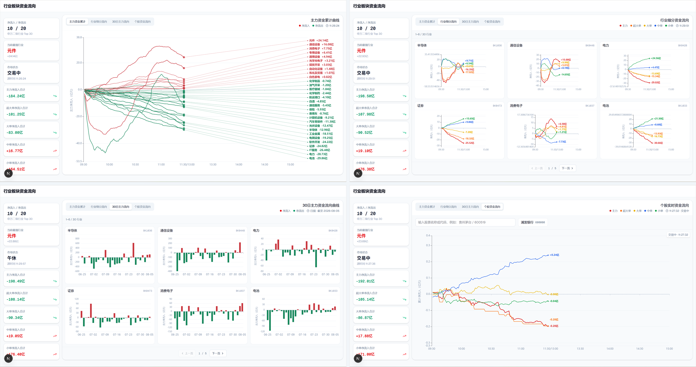

# CapitalPulse

A股行业板块、个股资金流向看板。采集行业板块以及个股的资金流数据，实时展示主力、超大单、大单、中单和小单的资金流向情况。

## 界面预览



## 功能特性

- 行业板块实时主力资金流监控
- 行业及个股资细分金流向监控
- 实时与历史数据可视化
- 本地数据持久化

## 项目结构

```text
CapitalPulse/
├── backend/
│   ├── routers/                    # REST API 路由
│   ├── services/                   # 行情采集、历史回填与持久化
│   ├── tests/                      # 后端单元测试
│   ├── utils/                      # 行业筛选等工具
│   ├── config.py                   # 上游接口配置
│   ├── main.py                     # FastAPI 入口
│   └── requirements.txt
├── frontend/
│   ├── public/                     # Logo 等静态资源
│   └── src/app/                    # Next.js 页面与样式
├── .gitignore
├── bun.lock                        # Bun 依赖锁定文件
├── LICENSE
└── package.json
```

运行时数据库默认保存在 `backend/data/sector_flow_realtime.sqlite3`。该目录已被 Git 忽略，不会随源代码提交。

## 环境要求

- Anaconda 或 Miniconda
- Bun 1.2+
- Node.js 20+
- Python 3.11+

## 使用 Anaconda 安装

打开 Anaconda Prompt 或已经初始化 Conda 的终端，进入项目根目录并创建独立环境：

```powershell
conda create -n capitalpulse python=3.11 -y
conda activate capitalpulse
```

安装后端 Python 依赖：

```powershell
python -m pip install --upgrade pip
python -m pip install -r backend\requirements.txt
```

安装前端依赖：

```powershell
bun install
```

确认环境安装成功：

```powershell
conda info --envs
python --version
node --version
bun --version
```

以后重新打开终端时，只需进入项目根目录并执行 `conda activate capitalpulse`，不需要重复安装依赖。

## 本地开发启动

分别打开两个 Anaconda Prompt 或 Conda 终端，并进入项目根目录。

终端一启动后端：

```powershell
conda activate capitalpulse
bun run dev:api
```

终端二启动前端：

```powershell
conda activate capitalpulse
bun run dev:web
```

启动后访问：

- 前端：<http://localhost:3000>


```dotenv
NEXT_PUBLIC_SECTOR_FLOW_WS_URL=wss://example.com/ws/sector-flow
```

建议使用 Nginx、Caddy 或其他反向代理统一暴露 HTTPS，并确保 `/ws/sector-flow` 支持 WebSocket 升级。SQLite 数据库默认位于 `backend/data/sector_flow_realtime.sqlite3`，部署时应为该目录配置持久化存储和写权限。

## 风险提示

本项目仅用于技术研究和数据展示，不保证数据的准确性、完整性与实时性，不构成任何投资建议。因使用本项目产生的交易、投资或其他损失，由使用者自行承担。

## License

本项目采用 [MIT License](LICENSE) 开源。
